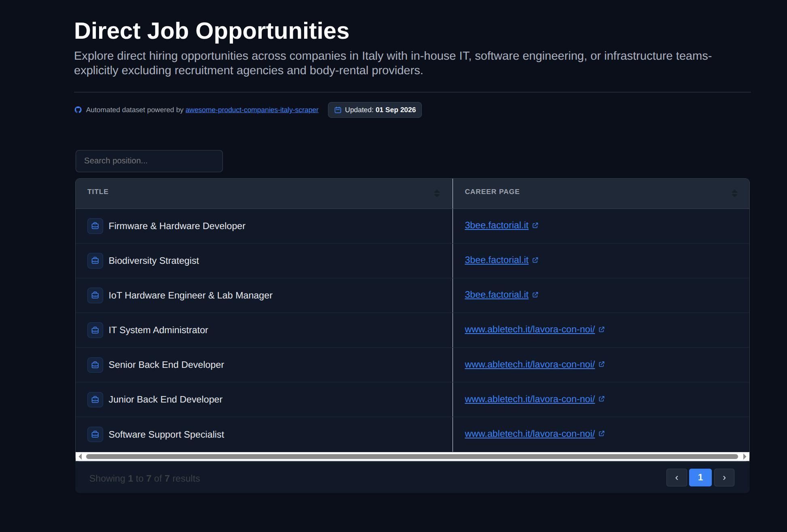

# Awesome Product Companies Italy - Job Scraper & Aggregator

An automated, local web scraping tool built with **Scrapy** and **`uv`** that monitors career pages of product companies listed in [awesome-product-companies-italy](https://github.com/asbarbati/awesome-product-companies-italy) and aggregates open positions into a clean, unified local static HTML dashboard.

---

## Overview

Finding tech jobs at direct product companies in Italy often requires manually visiting dozens of individual corporate career portals. This repository provides a Python command-line utility that crawls supported company job pages, extracts open roles, and outputs a single local HTML page for easy filtering, searching, and viewing.

This project is designed to be **run locally on your own machine**. The repository does **not** publish pre-rendered HTML files or run automated cloud scraping workflows (e.g., GitHub Actions). Running locally ensures:
1. **Fresh Data:** You always get live, real-time job listings directly from corporate portals.
2. **Avoiding Rate Limits & IP Blocks:** Centralized scrapers frequently trigger anti-bot protections, rate limits, or IP bans. Executing locally distributes network traffic naturally.


<p align="center">
  
</p>

---

## Key Features

- **Direct Employment Focus:** Inherits the core policy of [awesome-product-companies-italy](https://github.com/asbarbati/awesome-product-companies-italy) by targeting companies with in-house tech/IT teams while excluding body-rental providers and recruitment agencies.
- **Fast Local Setup with `uv`:** Uses [`uv`](https://github.com/astral-sh/uv) for lightning-fast dependency management and script execution.
- **Local Static HTML Dashboard:** Generates a lightweight, single-page HTML file containing all extracted job listings.
- **Transparent Exception Tracking:** Displays skipped or protected sites in a dedicated **Unsupported Portals** table within the generated report so no opportunities are missed.

---

## Scraping Scope & Limitations

To keep the project maintainable, fast, and light, the Scrapy spiders **do not** employ heavy browser automation tools (like Selenium or Playwright) or bypass complex anti-scraping systems (e.g., LinkedIn Jobs, Cloudflare CAPTCHAs, or heavily protected ATS portals).

- **Supported Portals:** Career sites with static/predictable HTML structures accessible via standard HTTP requests.
- **Skipped / Complex Portals:** Websites requiring advanced anti-bot evasion techniques (e.g., LinkedIn) are explicitly bypassed during automated scraping.
- **Manual Check Table:** All bypassed companies are listed in a separate table in your generated HTML dashboard with direct links, allowing you to quickly inspect them manually.

---
## Spiders
Below is an overview of the spiders and status:

| Status | Company |  Spider Name |
| :---:  | :---: | :---: |
| ACTIVE  | 3Bee S.r.l. | 3bee |
| ACTIVE  | Able Tech S.r.l. | abletech |
| ACTIVE  | Alperia S.p.A. | alperia |


---

## Quick Start

### Prerequisites

- **Python 3.13+**
- [**`uv`**](https://github.com/astral-sh/uv) (Fast Python package and project manager)

### Setup & Usage

```bash
# Clone the repository
git clone https://github.com/asbarbati/awesome-product-companies-italy-scraper.git
cd awesome-product-companies-italy-scraper

# Sync dependencies with uv
uv sync

# Run all spiders
uv run --directory src/awesome_product_companies_italy_scraper/scraper run_all_spiders.py

# Open src/awesome_product_companies_italy_scraper/scraper/output/output.html in your browser
```

---

## Contributing

Moved to [CONTRIBUTING.md](CONTRIBUTING.md)

---

## Contributors

<a href="https://github.com/asbarbati/awesome-product-companies-italy-scraper/graphs/contributors">
  
</a>

---

## License

This project is licensed under the GNU Affero General Public License v3.0 (AGPL-3.0) see the [LICENSE](LICENSE) file for details.